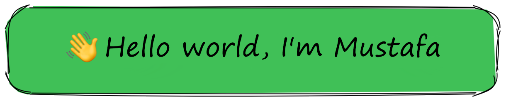

### Seni burda gördüğüme sevindim! &nbsp; 
Bana kısaca, günümüz teknolojileri çerçevesinde kendini sürekli yenileyen ve bilgilerini çevresine aktarmaya çalışan bir programcı diyebilirsiniz.
Programlamayı, yazmayı, konuşmayı ve seyahat etmeyi seviyorum. Bir yazılımcı olarak, ayrıntılara takıntılı dikkatimi, dünyayı değiştirecek şeyler yaratma konusundaki açık sevgimi kullanmaktan zevk alıyorum. Bu yüzden fark yaratan şeyler yapmayı seviyorum.

  

**Biraz Kişisel Konuşalım:**

- &nbsp;&nbsp; Şu anda harika bir şey üzerinde çalışıyorum;
- &nbsp;&nbsp; Bana bir şeyler sorabilirsin, Yardım etmek mutluluk verici;
- &nbsp;&nbsp; Beni linkedin üzerinden takip edebilirsin [linkedin](https://www.linkedin.com/in/mustafa-basdemir/)
- &nbsp;&nbsp; Dilersen instagram adresimi takip edebilirsin [instagram](https://www.instagram.com/mustafa_basdemirr/)
- &nbsp;&nbsp; Bana Ulaş: basdemir803@gmail.com;

 

#### Languages:

#### UX/UI:

#### Utilities:

#### DevOps:

